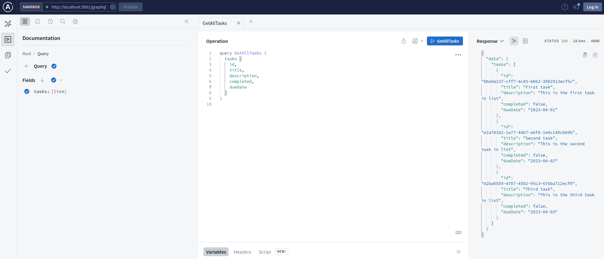

# GraphQL client-server todo application

<center> 
  
</center>

## Getting started

### Base variables

<p style="text-align: justify;">
  Copy <code>.env.sample</code> into <code>.env</code> or assign OS environment variables accordingly.
</p>

## How to run

* For client run the following commands:
    ```
       cd client
       yarn install
       yarn start
    ```

Application will be available on http://localhost:3000

* For server run the following commands:
    ```
       cd server
       npm install
       npm start
    ```
Application will be running on http://localhost:3003
